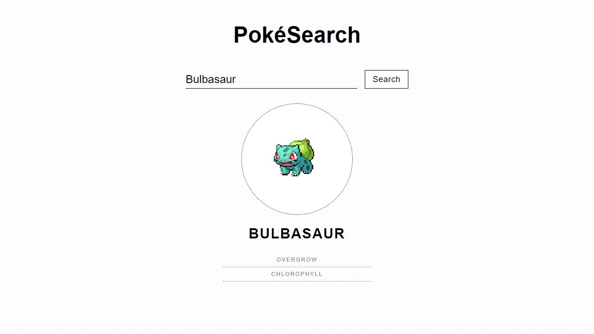

:bangbang::bangbang::bangbang: This repository is archived. Algebra Frontend developer course materials are available <a href="https://github.com/dstrekelj/algebra-front-end-developer-course-workbook">here</a>. :bangbang::bangbang::bangbang:

---

# Pokemon App

   
  <a href="https://dstrekelj.github.io/algebra-example-pokemon-app" target="_blank">
    
     
     
    <b>See it in action &mdash; https://dstrekelj.github.io/algebra-example-pokemon-app</b>
  </a>
   
   

---

## Features

### Current

- [x] Search for Pokémon by name or ID using [PokéAPI](https://pokeapi.co/)
- [x] Show search result
- [x] Show error message

### Upcoming

- [ ] Show more information on Pokémon
